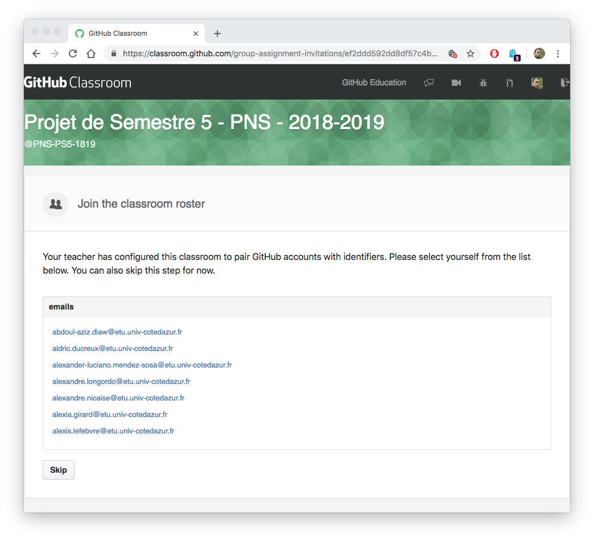
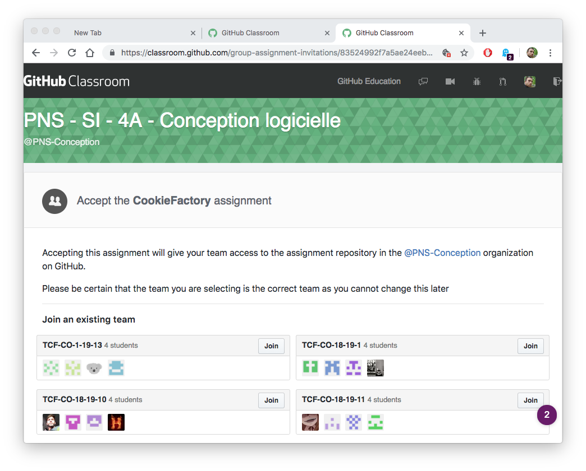
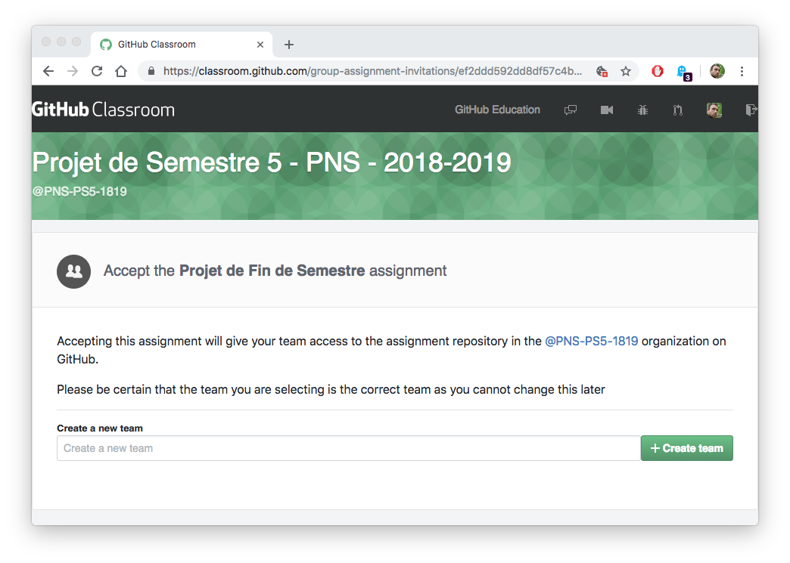
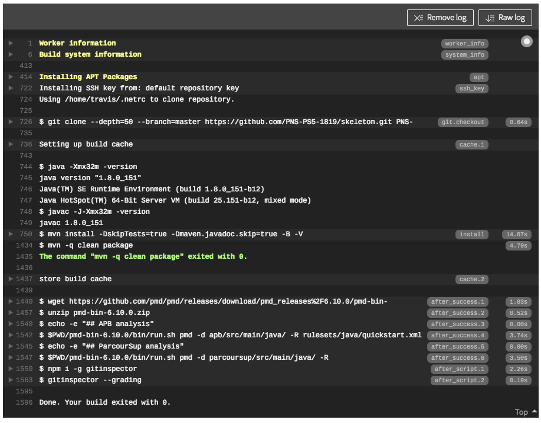
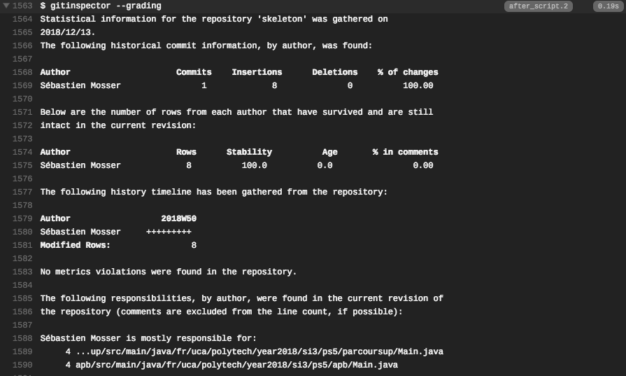
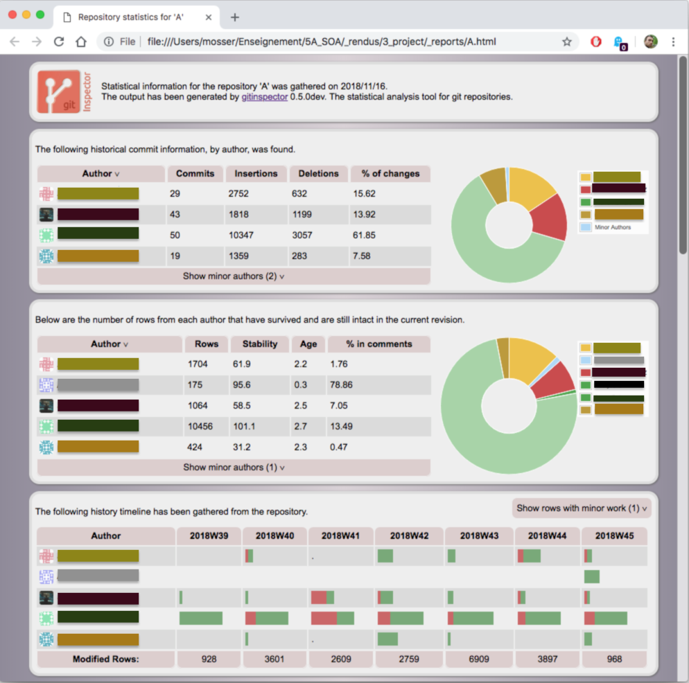

# Step 0: Setting up the environment

<div align="center">

<font color="red"><strong>Students who do not comply with the instructions in this section will lose 50% of their grade.</strong></font>

</div>

## Accepting the Project Assignment

Follow the GitHub Classroom link to accept the project assignment:

  * [https://classroom.github.com/g/pFwbFIkv](https://classroom.github.com/g/pFwbFIkv)

First, you have to pickup your _official_ email address in the course roster. This will be used by the notation system, so pick up the _right_ email address.



Then, you have two options. If your team already exists, simply click on the team name to join it.




If your project team does not exist yet, you can create a new team. This will create a new project repository for this newly created team, and clone an initial code skeleton in it.



<div align="center">

<font color="red"><strong>DO NOT CHANGE THE PROJECT MEMBERS DIRECTLY IN THE REPOSITORY, YOU MUST USE THE CLASSROOM MECHANISM TO BE INCLUDED IN THE GRADING SYSTEM AND IT CANNOT BE CHANGED LATER.</strong></font>

</div>

## Setting up the Git environment

By creating a new team or joining an existing one, it will give you access to a github repository under `PNS-PS5-1819`. You have to clone this project on your computer, _e.g._ using a `git clone` command. For example, if your team is named `staff`, it should look like the following:

```
azrael:~ mosser$ git clone https://github.com/PNS-PS5-1819/staff.git
Cloning into 'staff'...
remote: Enumerating objects: 62, done.
remote: Counting objects: 100% (62/62), done.
remote: Compressing objects: 100% (32/32), done.
remote: Total 62 (delta 15), reused 55 (delta 8), pack-reused 0
Unpacking objects: 100% (62/62), done.
azrael:~ mosser$ cd staff/
azrael:staff mosser$
```
You can verify that everything is correct by asking maven to compile the code skeleton:

```
azrael:staff mosser$ mvn clean package
[INFO] Scanning for projects...
[INFO] ------------------------------------------------------------------------
[INFO] Reactor Build Order:
[INFO] 
[INFO] Team AWESOME                                                       [pom]
[INFO] apb                                                                [jar]
[INFO] parcoursup                                                         [jar]
****
...
[INFO] Reactor Summary for Team AWESOME 1.0-SNAPSHOT:
[INFO] 
[INFO] Team AWESOME ....................................... SUCCESS [  0.006 s]
[INFO] apb ................................................ SUCCESS [  1.413 s]
[INFO] parcoursup ......................................... SUCCESS [  0.062 s]
[INFO] ------------------------------------------------------------------------
[INFO] BUILD SUCCESS
[INFO] ------------------------------------------------------------------------
[INFO] Total time:  1.649 s
[INFO] Finished at: 2018-12-13T19:24:51+01:00
[INFO] ------------------------------------------------------------------------
```


Finally, to ensure that you are correctly detected by the grading system, you must specify your credentials (real name and email address):

```
azrael:staff mosser$git config user.name "John Doe"
azrael:staff mosser$git config user.email "john.doe@etu.univ-cotedazur.fr"
```

<div align="center">

<font color="red"><strong>STUDENTS WHO DO NOT USE OFFICIAL CREDENTIALS AFTER MONDAY 13:00 WILL BE REJECTED BY THE GRADING SYSTEM.</strong></font>

</div>

## Understanding the architecture

Your project contains initially the following files:

```
azrael:skeleton mosser$ tree -a -I '.git*' .
.
|-- .travis.yml
|-- README.md
|-- apb
|   |-- pom.xml
|   `-- src
|       `-- main
|           `-- java
|               `-- fr
|                   `-- uca
|                       `-- polytech
|                           `-- year2018
|                               `-- si3
|                                   `-- ps5
|                                       `-- apb
|                                           `-- Main.java
|-- dataset
|-- install.md
|-- parcoursup
|   |-- pom.xml
|   `-- src
|       `-- main
|           `-- java
|               `-- fr
|                   `-- uca
|                       `-- polytech
|                           `-- year2018
|                               `-- si3
|                                   `-- ps5
|                                       `-- parcoursup
|                                           `-- Main.java
`-- pom.xml

23 directories, 8 files

``` 

  * The `install.md` file contains information to retrieve the datasets to be used. **Please follow its contents to populate automatically the `dataset` directory**;
  * The `README.md` file should be updated to reflect your team contents. It will be used as a journal, so you should provide each day a brief report on what happened during the day;
  * The directory contains three `pom.xml` files, reflecting the three modules modelled in this system: 
    *  The `./pom.xml` file is the `root` one. Change its contents to replace the `team.name` tag, and the `groupId` one with your assigned identifier.
    *  The `./apb/pom.xml` file is the pom that controls the `APB` implementation. Edit its contents to change the `groupId` one to match the root one.
    *  The `./parcoursup/pom.xml` file is the pom that controls the `ParcourSup` implementation. Do the same modification than for APB.
  * The `travis.yml` file describes the continuous integration process, see the associated section. 


## Accessing the Continuous Integration server

Thanks to Travis academic offer, your project is automatically linked to a continuous integration server. It means that each time you `push` your code to the Github repository, the following process is triggered:

  1. It compiles your code using the following command: `mvn clean package`
  2. If the compilation succeeds, it runs the `PMD` tools to analyse the quality of your code and detect bad smells;
  3. In any case, it runs the `Git Inspector` tool to analyse code paternity.

For each commit, you can connect to [TravisCI](http://travis-ci.com) to see its status.




### Example of `PMD` output

PMD is a static code analysis tools that can identify classical issues in your code. It will help you to improve code quality.

```
azrael:3A_test_framework mosser$ $PWD/pmd-bin-6.10.0/bin/run.sh pmd -d polyunit/src/main/java -R rulesets/java/quickstart.xml -f text
Dec 13, 2018 7:54:06 PM net.sourceforge.pmd.PMD processFiles
WARNING: This analysis could be faster, please consider using Incremental Analysis: https://pmd.github.io/pmd-6.10.0/pmd_userdocs_incremental_analysis.html
fr/unice/polytech/qgl/tests/unit/Runner.java:3:	Avoid unused imports such as 'fr.unice.polytech.qgl.tests.unit.annotations'
fr/unice/polytech/qgl/tests/unit/Runner.java:28:	Substitute calls to size() == 0 (or size() != 0, size() > 0, size() < 1) with calls to isEmpty()
fr/unice/polytech/qgl/tests/unit/Runner.java:52:	This statement should have braces
fr/unice/polytech/qgl/tests/unit/Runner.java:63:	This statement should have braces
fr/unice/polytech/qgl/tests/unit/TestResult.java:21:	Position literals first in String comparisons
fr/unice/polytech/qgl/tests/unit/annotations/Test.java:14:	Exceptions should not extend java.lang.Throwable
fr/unice/polytech/qgl/tests/unit/annotations/Test.java:14:	The class name 'DEFAULT_EXPECTATION' doesn't match '[A-Z][a-zA-Z0-9]*'
fr/unice/polytech/qgl/tests/unit/assertions/Assertion.java:3:	All methods are static.  Consider using a utility class instead. Alternatively, you could add a private constructor or make the class abstract to silence this warning.
fr/unice/polytech/qgl/tests/unit/assertions/Assertion.java:3:	The utility class name 'Assertion' doesn't match '[A-Z][a-zA-Z0-9]+(Utils?|Helper)'
fr/unice/polytech/qgl/tests/unit/assertions/Assertion.java:12:	This statement should have braces
fr/unice/polytech/qgl/tests/unit/assertions/Assertion.java:17:	This statement should have braces
fr/unice/polytech/qgl/tests/unit/assertions/Assertion.java:23:	This statement should have braces
fr/unice/polytech/qgl/tests/unit/assertions/AssertionFailedError.java:3:	Exceptions should not extend java.lang.Error
```

### Example of `Git Inspector` output

Git Inspector is used to analyse your `git` history and identify contribution of each team member in the project.




The tool can also generate HTML reports that shows team member's contributions.


